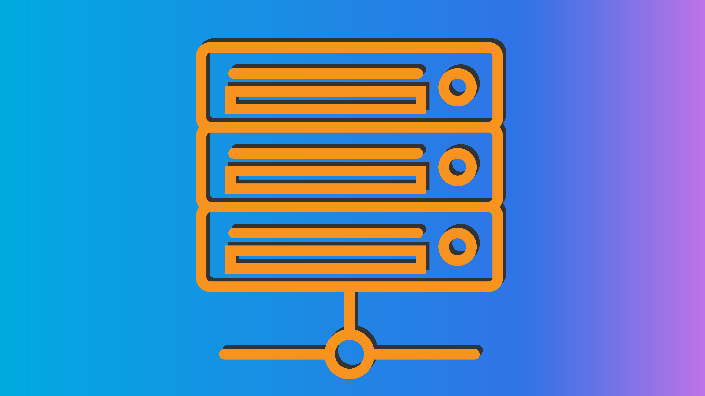

# ChuggBot 

Discord + Chegg = Chugg Bot

List of third party packages can be found [here](./Credits.md).

---

### <strong>Disclaimer:</strong>

This is just a project for my personal experience and intended for educational purposes only. I do not hold any responsiblity if <em>YOU, the user,</em> chooses to utilize this bot in any manner that goes against Chegg's guidelines.

---

### [MIT License](./LICENSE)

